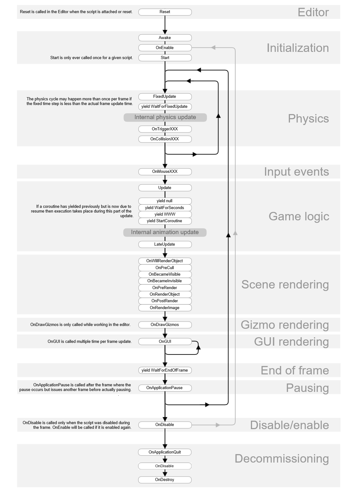

#### Scene View
* 개발자와 상호작용하는 환경
 

#### Game View
* 사용자가 보는 환경
* 카메라를 통해 볼 수 있는 환경
 

#### 사용방법
* 마우스 우클릭 : 현재 시점에서 가상 환경 둘러보기
* 마우스 우클릭 한 채로 W : 시점 고정한 채로 화면 확대
* 마우스 우클릭 한 채로 S : 시점 고정한 채로 화면 축소
* 마우스 우클릭 한 채로 A : 시점 고정한 채로 좌로 이동
* 마우스 우클릭 한 채로 S : 시점 고정한 채로 우로 이동
* Inspector창에서 활성화 된 오브젝트 알 수 있는데 이때 Scene View에 마우스 두고 F 누르면 해당 오브젝트 보임
* 오브젝트 활성화된 상태에서 ALT 누르고 마우스 좌클릭하면 360도 회전하면서 해당 오브젝트 보임
* 오브젝트 활성화된 상태에서 ALT 누르고 마우스 우클릭 한 채로 왼쪽으로 이동하면 화면 축소
* 오브젝트 활성화된 상태에서 ALT 누르고 마우스 우클릭 한 채로 오른쪽으로 이동하면 화면 확대

 

#### 유니티 좌표계
* Local 좌표계와 Global 좌표계로 구성됨
* Local 좌표계
  * 오브젝트 기준 시점의 좌표
  * Local 좌표는 부모 객체의 영향을 받음
  * Inspector창에서 보이는 transform 값은 Local 좌표 기준
  * 큐브 하나를 (1, 0, 0)에 생성하고 (1, 0, 0)에 자식을 하나 생성한 후 부모의 x값을 10으로 변경해도 자식의 x값은 1(부모 기준으로 자식이 1이기 때문)
* Global 좌표계
  * 유니티 가상 공간의 기준 좌표
  * 큐브 하나를 (1, 0, 0)에 생성하고 (1, 0, 0)에 자식을 하나 생성한 후 부모의 x값을 10으로 변경하면 글로벌 좌표 기준 (10, 0, 0)이 되고 자식은 (11, 0, 0)이 됨

 

#### Vector3
* Vector3.zero : Vector3(0, 0, 0)인 벡터
* Vector3.one : Vector3(1, 1, 1)인 벡터
* Vector3.forward : Vector3(0, 0, 1)인 벡터
* Vector3.back : Vector3(0, 0, -1)인 벡터
* Vector3.up : Vector3(0, 1, 0)인 벡터
* Vector3.down : Vector3(0, -1, 0)인 벡터
* Vector3.left : Vector3(-1, 0, 0)인 벡터
* Vector3.right : Vector3(1, 0, 0)인 벡터

 

#### deltaTime
* fps는 기기마다 다름
* A기기의 fps가 10, B기기의 fps가 50이고 프레임당 1씩 이동한다고 가정하면 A, B기기는 각각 1초에 10, 50만큼 이동하므로 같은 거리를 이동하지 않음
* deltaTime은 프레임이 완료되는데 걸린 시간
* A기기의 deltaTime은 1/10초, B기기의 deltaTime은 1/50초
* 각 기기에서 이동하는 거리에 deltaTime을 곱하면 프레임당 A, B기기는 1/10, 1/50만큼 이동하고 결과적으로 같은 거리만큼 이동함
* deltaTime을 곱하면 프레임당이 아니라 초당으로 적용됨

 

#### Game Object
* 게임 오브젝트는 유니티 엔진에서 가장 기본이 되는 개념
* 캐릭터나 아이템, 배경으로 배치된 건물이나 소품, 빛을 밝히는 광원이나 카메라까지 Scene에 배치되는 모든 것이 게임 오브젝트
* 게임 오브젝트에 어떤 컴포넌트를 붙이는지에 따라 게임 오브젝트가 캐릭터가 되거나 아이템이 되거나 배경이 되거나를 결정
* 이름(Name-"GameObject"), 태그(Tag-"Untagged"), 레이어(Layer-"Default")를 가짐

 

#### Component
* 게임 오브젝트에 붙일 수 있는 다양한 기능을 가진 구성요소
* Transform Component : 모든 게임 오브젝트에 기본으로 부착되며 제거할 수 없음, Position과 Rotation, Scale 특성을 결정
* RigidBody : Rigidbody 물리 개념을 적용해 실제 물리 세계를 적용
* Collider
  * 충돌에 관한 모든 것들을 관리(플레이어가 쏜 총알이 적을 맞춘다, 차가 벽을 박는다)
  * Rigidbody가 먼저 적용되야함
  * Is Trigger 옵션 : Trigger로 동작할 것인지, Collision으로 동작할 것인지
  * Trigger : 마트의 도난 방지 장치처럼 물체를 통과시키되 지나가는 물체를 감지하는 것
  * Collision : 벽이나 바닥처럼 물체를 통과하지 못하게 막는 것

 

#### Update()
* 프레임마다 호출되는 함수로 fps가 다르다면 Update()가 호출되는 빈도가 다름
 

#### FixedUpdate()
* 고정적인 시간으로 반복적으로 호출됨
* Update()와 달리 프레임에 기반하지 않고 고정적인 시간으로 동작해 유니티 물리 계산이 실행됨
* 물리 효과가 적용된(Rigidbody) 오브젝트를 사용할 때 적합
 

#### LastUpdate()
* 모든 Update()가 호출된 후 마지막으로 호출됨
* 오브젝트를 따라가는 카메라를 사용할 때 적합

 

#### Coroutine
* 유니티에서 특정 코드가 반복적으로 수행되기 위해서는 Update()에 작성하지만 원하던 원하지 않던 계속 반복해서 수행됨
* RPG게임에서 포션을 5초마다 먹을 수 있다고 가정할 때 코루틴 사용하지 않으면 Update()에 작성해야함
* 코루틴을 사용하면 필요한 순간에만 반복하고 필요하지 않은 순간에는 사용하지 않아 자원을 효율적으로 사용할 수 있음
* 반환형이 IEnumerator이고 yeild return으로 리턴해야함
* yield return은 지정한 시간만큼 유니티에게 제어권을 넘기고 대기함
  * yield return null; : 다음 프레임에 실행됨
  * yield return new WaitForSeconds(float); : 매개변수로 입력한 숫자에 해당하는 현실 시간의 초단위만큼 기다렸다가 실행
  * yield return new WaitForSecondsRealtime(float); : 매개변수로 입력한 숫자에 해당하는 유니티 시간의 초단위만큼 기다렸다가 실행
* yield break; : 코루틴 끝냄

 

#### MonoBehaviour
* 모든 Unity 스크립트가 상속하는 기본 클래스
* 컴포넌트에 필요한 기본적인 기능 제공
* MonoBehaviour 클래스를 사용하면 코루틴을 관리할 수 있어 특정 시간동안 기다리거나 특정 작업이 완료될 때까지 기다리면서 다른 코드를 실행하는 비동기 방식으로 수행 가능
* MonoBehaviour 클래스는 이벤트 함수(Start(), Update(), OnBecameVisible(), OnCollisionEnter(), OnDestroy() 등등)에 대한 엑세스를 제공
* MonoBehaviour FlowChart(https://docs.unity3d.com/kr/530/Manual/ExecutionOrder.html)
  
